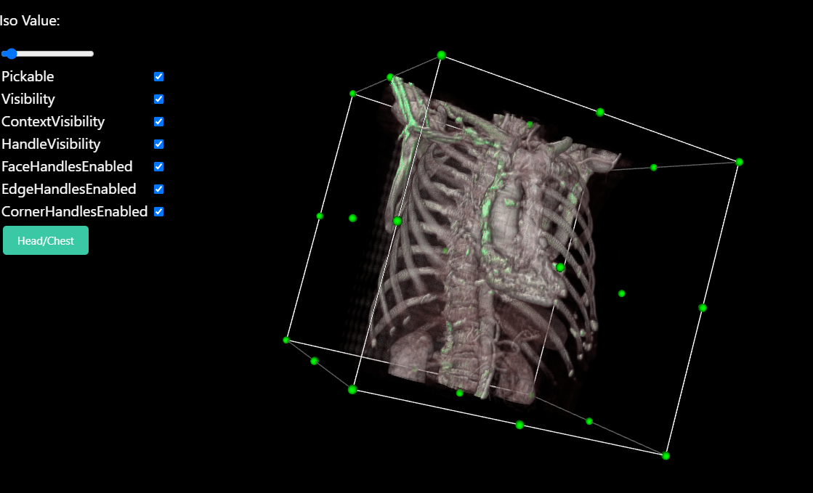
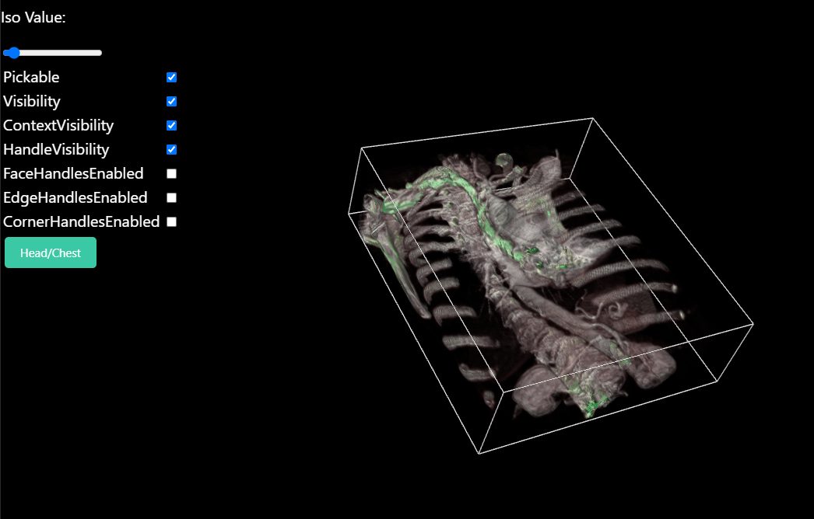
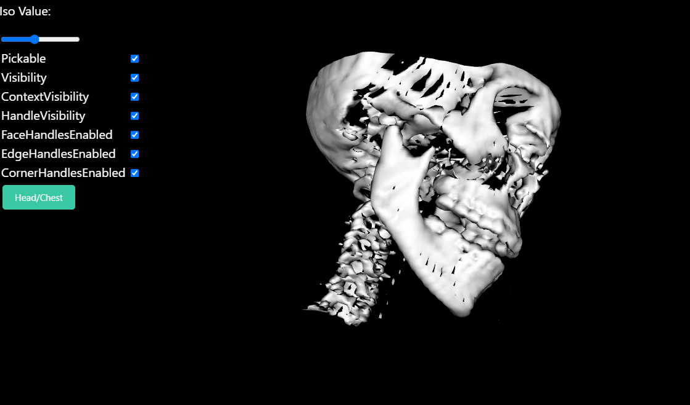
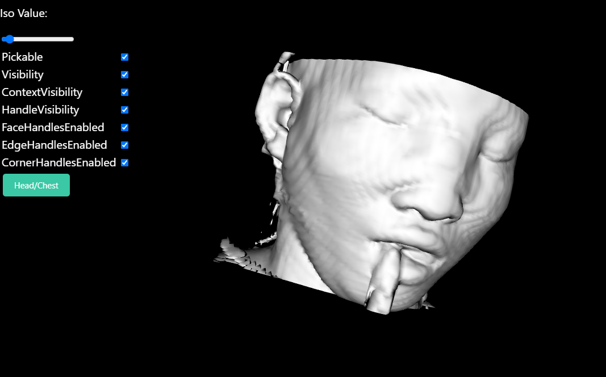

# Medical Visualization

## Contributors 
Name | Github
------|----------
Andrew Mohsen | Andrew2077
Mohamed Osama | osama51
Mohamed Alaa | mohammed-44


## Introduction:

In this project we used VTK.js & HTML with React to build a web page 
the Web contains the following funcitonality

- open widget with example from vtk.js to display * human chest* and slider to manipulate the 3D image this view can be cropped by the user. 




- open widget with example from vtk.js to display * human skull* and slider and push bottom to manipulate variable ISO value in  3D image.



## Web implementation

the whole implementation is based on the example of VTK of the human skull and human chest with react elements.

we wrote our main function in App.js for two seperate model in two seperate functions 
the UI for both example were added in the same file using react which facilitated the implementation of both javascript and HTML codes.
the App function was imported in the index.js file which will then be used inside of reactDOM.render

REACTDOM translate the HTML part into a readable sentences by java script

In the Vtk part we created a fullscreen render window and created the renderer, also actor we connected the actor with the renderer and made an object from the mapper and conneccted it to the actor  and the marching Cube were created and connected to the mapper.


To switch between the two example we used an if condition with flag
that detects which example will be rendered, the if condition was applied to the reader part  


```javascript
let flag=1;
function iso (){
if (flag == 0){ 
        flag = 1;
        reader.setUrl(`https://kitware.github.io/vtk-js/data/volume/LIDC2.vti`).then(() => { ,,,
...     //render first model
} else {
        flag = 0;
        console.log(flag)
        reader
        .setUrl(`https://kitware.github.io/vtk-js/data/volume/headsq.vti`, { loadData: true })
        .then(() => {,,,
        //render second model
        }

```
## Issues Faced

- while creating the project we faced some problems and decided to drop some features that would've took forever to implement 
-  It was difficult to understand example codes and vtk.js library system in order to be able to edit and customize the code.
We overcome this problem by searching and applying try and error technique.